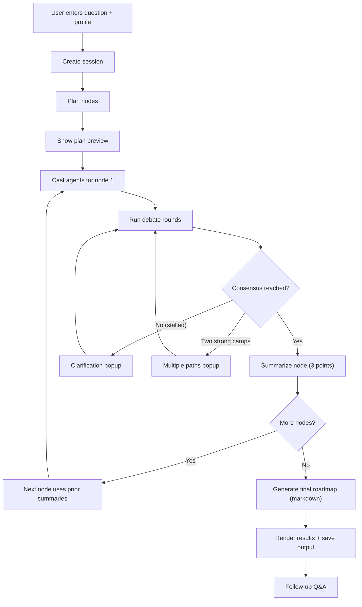

## 1. Product Overview
Decision Engine is a guided decision-making web app that turns a user question into a step-by-step plan (nodes), runs multi-agent debates per node until consensus, and outputs a final markdown roadmap with saved reasoning for follow-ups.
- Target users: individuals and small teams making complex choices (career, business, life planning)
- Value: structured decisions, transparent reasoning, and persistent “why” for later follow-up

## 2. Core Features

### 2.1 User Roles
Single role for MVP: anonymous user (no authentication).

### 2.2 Feature Module
1. **Start**: enter question + profile, create a session
2. **Decision Session**: generate plan (nodes), cast agents, run debates with clarifications, show progress
3. **Result**: render final markdown roadmap, allow follow-up Q&A

### 2.3 Page Details
| Page Name | Module Name | Feature description |
|-----------|-------------|---------------------|
| Start | Question input | Textarea for question, textarea for user profile/context |
| Start | Session create | Start button creates a new session and moves into the session page |
| Decision Session | Plan preview | Shows generated node list before running debates |
| Decision Session | Run controls | Start / pause / resume / next-step controls for MVP debugging |
| Decision Session | Node progress | Step indicator (current node, completed nodes) |
| Decision Session | Debate stream | Shows agent messages per round; includes vote and reasoning |
| Decision Session | Clarification popup | When debate stalls, ask user a question, save answer, continue |
| Decision Session | Multiple paths popup | When two camps persist, show two options with pros/cons and ask user to pick a direction |
| Result | Roadmap markdown | Render final markdown output and allow copy-to-clipboard |
| Result | Follow-up chat | Ask “why / what if” questions using stored debate context |

## 3. Core Process
User flow: create session → plan nodes → debate nodes sequentially with summaries → generate final roadmap → follow-up Q&A.

## 4. User Interface Design

### 4.1 Design Style
- Direction: editorial / “research notebook” (high-contrast, typographic, calm)
- Color tokens: neutral base (zinc) + one accent (cyan) + warning accent (amber)
- Typography: distinctive display font for headings, readable serif or humanist for body
- Layout: desktop-first, two-column debate view (stream + context), collapses to single column on mobile
- Interaction: subtle motion for message arrival, clear progress states, sticky node progress header

### 4.2 Page Design Overview
| Page Name | Module Name | UI Elements |
|-----------|-------------|-------------|
| Start | Question input | Large textareas, example prompt chips, clear CTA |
| Decision Session | Debate stream | Chat-like cards per agent, round separators, vote chips |
| Decision Session | Popups | Modal with one question (clarification) or two-column pros/cons (paths) |
| Result | Markdown | Styled markdown renderer, “Copy markdown” button, follow-up input pinned at bottom |

### 4.3 Responsiveness
Desktop-first with mobile adaptation:
- Collapse to single column
- Modals become full-screen sheets on small screens
- Ensure debate stream is scrollable and readable

## 5. Non-Goals (MVP)
- No login/accounts
- No PDF export
- No session history browser
- No diagram generation beyond optional simple Mermaid rendering in output
