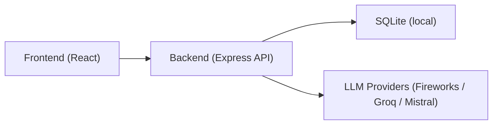
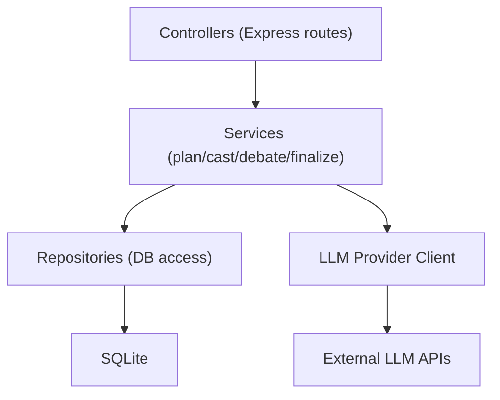
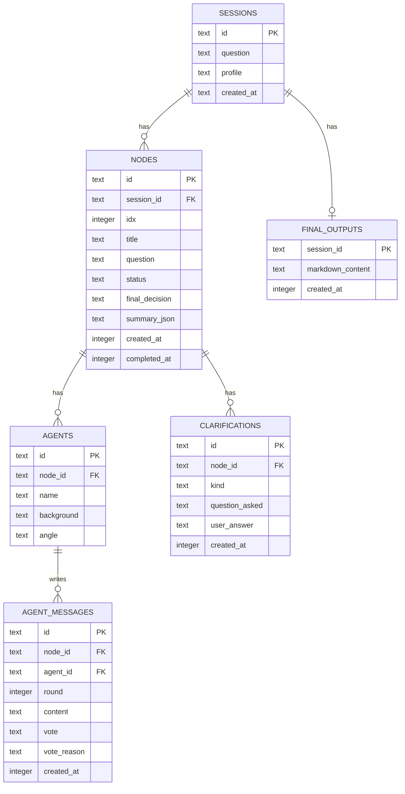

## 1. Architecture Design

## 2. Technology Description
- Frontend: React@18 + TypeScript + react-router-dom + tailwindcss + zustand
- Backend: Express@4 + TypeScript (ESM)
- Database (MVP): SQLite file stored locally (no external credentials required)
- External services: LLM provider APIs (Fireworks, Groq, Mistral) via HTTPS
- Markdown rendering: react-markdown

## 3. Route Definitions
| Route | Purpose |
|-------|---------|
| / | Start page (question + profile) |
| /session/:sessionId | Plan + debate flow |
| /session/:sessionId/result | Final roadmap + follow-up |

## 4. API Definitions

### 4.1 Shared Types (conceptual)
- Session: id, question, profile, createdAt
- Node: id, sessionId, title, question, status, finalDecision, summary
- Agent: id, nodeId, name, background, angle
- AgentMessage: id, agentId, nodeId, round, content, vote, voteReason, createdAt
- Clarification: id, nodeId, kind, questionAsked, userAnswer, createdAt
- FinalOutput: sessionId, markdownContent, createdAt

### 4.2 Endpoints

#### POST /api/sessions
Creates a session.
- Request: { question: string, profile: string }
- Response: { sessionId: string }

#### POST /api/plan
Generates decision nodes.
- Request: { sessionId: string }
- Response: { nodes: Array<{ id: string, title: string, question: string }> }

#### POST /api/cast
Generates agent personas for a node.
- Request: { sessionId: string, nodeId: string }
- Response: { agents: Array<{ id: string, name: string, background: string, angle: string }> }

#### POST /api/debate
Runs debate rounds for a node until consensus or intervention.
- Request: { sessionId: string, nodeId: string, mode?: "auto" | "step", maxRounds?: number }
- Response:
  - If consensus: { status: "consensus", finalDecision: string, summary: string[] }
  - If needs clarification: { status: "clarification", question: string }
  - If multiple paths: { status: "paths", options: Array<{ key: string, label: string, pros: string[], cons: string[] }> }
  - Otherwise: { status: "in_progress", round: number }

#### POST /api/clarify
Stores a user answer for a clarification/path choice and resumes debate context.
- Request:
  - Clarification: { sessionId: string, nodeId: string, kind: "clarification", answer: string }
  - Paths: { sessionId: string, nodeId: string, kind: "paths", chosenKey: string, rationale?: string }
- Response: { ok: true }

#### POST /api/finalize
Generates final roadmap markdown after all nodes are completed.
- Request: { sessionId: string }
- Response: { markdown: string }

#### POST /api/followup
Answers a follow-up question using stored context.
- Request: { sessionId: string, question: string }
- Response: { answer: string }

## 5. Server Architecture Diagram

## 6. Data Model

### 6.1 Data Model Definition

### 6.2 Data Definition Language
The implementation will create the following tables on startup if they do not exist:
- sessions
- nodes
- agents
- agent_messages
- clarifications
- final_outputs

## 7. LLM Provider Strategy (MVP)
- Backend reads env vars to select provider and API keys.
- If no API key is configured, backend uses a deterministic mock provider so the app remains runnable in development.
- Prompts return strict JSON for plan/cast and structured outputs for debate/finalize/followup.
